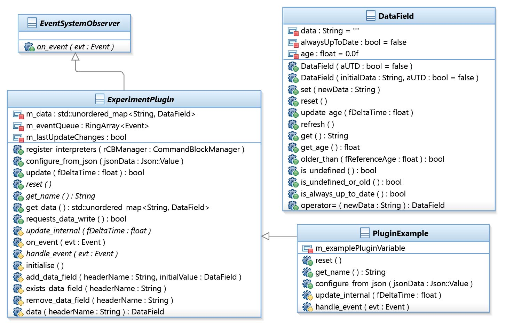

# REVEAL Experiments

[REVEAL](https://shura.shu.ac.uk/22448/) is a C++ framework for creating environmental narrative games in virtual reality using the PlayStation VR.
It was expanded by HCI experiment functionality in the context of the Research and Development Project 2018 module by Johannes Schirm.
It provides an extensible plug-in system which allows reliable data recording, as well as a variety of new system commands that can easily be triggered from gameplay definition files.
The main configuration file for the experiment framework is *Media/Config/experiment_config.json*, which defines possible experiment conditions, active plug-ins, trigger logic and any additional parameters.

## Usage

All provided source code and asset files have been created by Johannes Schirm, with the exception of *REVEAL/RevealPhyreLib/rv/GamePlay/GameStates/GameStateExperiment.\**, which is a modification of the source code for another game state.
Also, *REVEAL/RevealLib/AudioFile/AudioFile.\** represent a modified version of the free and open-source module "AudioFile".

To integrate the experiment system into another REVEAL application, the following steps are necessary:

Define ```GamePlay::EGameState::kExperimentSetup``` and ```GamePlay::EGameState::kExperiment``` in *REVEAL/RevealPhyreLib/rv/GamePlay/GameStates/GameStatesReveal.h*.

Create the constant variables ```GamePlay::GameStateExperimentSetup``` and ```GamePlay::GameStateExperiment```, and register them for the state IDs ```GamePlay::EGameState::kExperimentSetup``` and ```GamePlay::EGameState::kExperiment``` in *REVEAL/RevealPhyreLib/rv/Framework/RevealApplication.cpp*.

Define
```Events::ERevealEventChannels::kExperimentChannel```,
```Events::ERevealEventTypes::kExperiment_Start```,
```Events::ERevealEventTypes::kExperiment_End```,
```Events::ERevealEventTypes::kExperiment_Abort```,
```Events::ERevealEventTypes::kExperiment_SetCondition```,
```Events::ERevealEventTypes::kExperiment_IncrementCondition```,
```Events::ERevealEventTypes::kExperiment_StartHMDRecording```,
```Events::ERevealEventTypes::kExperiment_StopHMDRecording```,
```Events::ERevealEventTypes::kExperiment_IssueActivityMarker```,
```Events::ERevealEventTypes::kExperiment_Trigger```,
```Events::ERevealEventTypes::kExperiment_StartAudioRecording```,
```Events::ERevealEventTypes::kExperiment_StopAudioRecording```,
```Events::ERevealEventTypes::kExperiment_StartControllerCheck```,
```Events::ERevealEventTypes::kExperiment_StartHandsRecording``` and
```Events::ERevealEventTypes::kExperiment_StopHandsRecording```, and define and implement ```Events::ERevealEventTypes::kGamePlay_SwitchController``` and ```Events::ERevealEventTypes::kGamePlay_SetControllerMovement``` in *REVEAL/RevealPhyreLib/rv/GamePlay/RevealEvents.h*.

Add
```cpp
#ifdef ENABLE_EXPERIMENT
	Experiment::ExperimentManager::register_interpreters(m_cmdBlockManager);
#endif
```
to ```GamePlay::GlobalGameState::init()``` in *REVEAL/RevealPhyreLib/rv/GamePlay/GlobalGameState.cpp*.

*REVEAL/RevealPhyreLib/rv/GamePlay/vr_player_new.\** and *REVEAL/RevealPhyreLib/rv/RevealConfig_new.h* need to be merged into your implementations in *REVEAL/RevealPhyreLib/rv/GamePlay/vr_player.\** and *REVEAL/RevealPhyreLib/rv/RevealConfig.h*.

Finally, use ```Experiment::ExperimentManager::set_participant(const u32 number)``` to set the participant number an switch to ```EGameState::kExperiment``` to start the experiment.

## Conditions

Conditions represent exactly that:
Variables which are always present.
The main configuration file can contain an array "conditions" that contains objects with the condition's name in the "name" field and optionally a default value in the "value" field for initialisation.
The condition is set to this default value (or to undefined if it was not provided) at the beginning of each experiment.
Gameplay commands should then be used to update the condition values during the experiment.
All conditions are written to the output file for each new line, since they are supposed to always have a valid value.
Changing condition values produces a new line in the output file, too, despite their more passive nature.

## Plug-ins

Plug-ins are C++ classes which inherit from rv::Experiment::ExperimentPlugin.
They can listen for events on the gameplay and experiment event channels, receive regular frame updates, load JSON configurations and register their own commands.
The clear interface of the plug-in base class makes it easy to integrate additional behaviour easily without knowledge of the whole codebase.
Plug-ins are optimised for CSV data recording:
They can register new columns and maintain one data field for each of them.
The experiment framework automatically takes care of writing the corresponding CSV output file over time when the values of data fields change.
The following UML class diagram gives an overview of how the different interfaces work together:



Usually, plug-ins just create all the columns they need by calling *add_data_field* in their constructor.
They also need to call *initialise* in order to be correctly loaded.
Then, most plug-ins just keep assigning new strings to the data fields whenever they want to change a value.
*data* returns the corresponding data field for a column name.
Each plug-in must also override *reset* in order to be completely reset when a new experiment begins.
This means not only data fields, but also internal helper variables that might be used to manage data output.
Finally, plug-ins must provide an unique name through *get_name*, which will be used to allow the plug-in's activation in the configuration by name.

The array "plugins" in the main configuration file contains objects with the plug-in's name in the "name" field and optionally other configuration properties which are understood by the plug-in.
The experiment framework will provide these plug-in-specific parameters through *configure_from_json* when the main configuration file is loaded.

## Trigger

Experiment trigger allow adjusting the application's behaviour based on the current participant number.
Correctly used, this can replace most of the logic that would otherwise have to be coded in C++ manually.
In the main configuration file, the array "triggers" contains objects with the trigger's name in the "name" field, at least two existing command block names in the array field "commandBlocks" and an integer in the "participantRotateInterval" field, which defines the mapping pattern.
The rotate interval means: After *X* participants getting a specific command block from the array executed, the next participant will get the subsequent command block.
In other words, this mechanism lets participants cycle through the array of possible command blocks with variable speed.

## System commands

- **set_experiment_condition**
	Sets the value of the experiment condition with the name specified at "condition" to the value specified at "value".
- **increment_experiment_condition**
	Increments the value of the experiment condition with the name specified at "condition" by 1 or optionally by the integer specified at "increment".
	This will only work if the condition's value can be interpreted as an integer!
- **experiment_trigger**
	Executes one of the command blocks available for the experiment trigger with the name specified at "trigger" depending on the current participant number and the rotate interval of this specific trigger.
- **start_experiment**
	Starts a new experiment by opening an output file with the current participant number and activating the experiment system.
- **end_experiment**
	Signals successful completion of the experiment that is currently running.
	This will close the output file and transition back into the experiment menu.
- **abort_experiment**
	Aborts the experiment that is currently running.
	This will mark the output file as incomplete and jump back to the experiment menu.
- **start_audio_recording**
	Starts appending the audio input generated by the microphone to the participant's audio output file until stopped.
- **stop_audio_recording**
	Stops recording audio until started again.
	The audio output file will only be written after the experiment was successfully completed!
- **start_controller_check**
	Starts a fixed interaction sequence that asks the participant to press specific buttons on the controller.
	Afterwards, and only if provided, the command block with the name specified at "callbackBlock" will be executed.
- **issue_activity_marker**
	Names all the player activity in virtual reality that was recorded since the last marker until now using the name specified at "marker" and writes a new line to the output file.
- **start_hmd_recording**
	Starts recording the player's HMD matrix in tracking space in the interval provided as part of the plug-in configuration, or optionally in the interval specified at "recordIntervalSeconds".
- **stop_hmd_recording**
	Stops recording the player's HMD matrix.
- **switch_controller**
	Switches the controller, which is the logical unit that processes user input and takes according actions, to the one with the name specified at "controller" and deactivates the old controller.
	Controller names are defined at ```rv::GamePlay::Controller::g_locomotionControllerNames```.
	Current values are: *NullController*, *PointerController*, *NodeGraphController*, *FreeController* and *PauseController*.
- **set_controller_movement**
	Enables or disables continuous movement for the current controller according to the flag specified at "enable".
